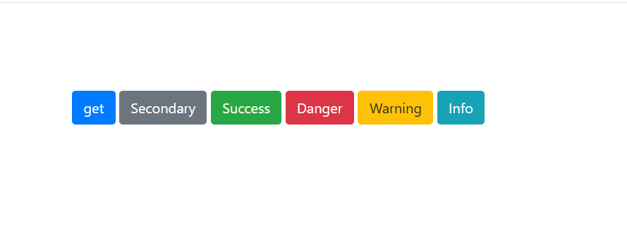

## 前言
Axios 是一个基于 promise 的 HTTP 库，可以用在浏览器和 node.js 中。

## 特性

1. 从浏览器中创建 [XMLHttpRequests](https://developer.mozilla.org/en-US/docs/Web/API/XMLHttpRequest)
2. 从 node.js 创建 [http](https://nodejs.org/api/http.html) 请求
3. 支持 [Promise](https://developer.mozilla.org/en-US/docs/Web/JavaScript/Reference/Global_Objects/Promise) API
4. 拦截请求和响应
5. 转换请求数据和响应数据
6. 取消请求
7. 自动转换 JSON 数据
8. 客户端支持防御 [XSRF](https://en.wikipedia.org/wiki/Cross-site_request_forgery)

## 项目目录结构

```
├── /lib/                      # 项目源码目
│ ├── /adapters/               # 定义发送请求的适配器
│ │ ├── http.js                # node环境http对象
│ │ └── xhr.js                 # 浏览器环境XML对象
│ ├── /cancel/                 # 定义取消功能
│ ├── /helpers/                # 一些辅助方法
│ ├── /core/                   # 一些核心功能
│ │ ├── Axios.js               # axios实例构造函数
│ │ ├── createError.js         # 抛出错误
│ │ ├── dispatchRequest.js     # 用来调用http请求适配器方法发送请求
│ │ ├── InterceptorManager.js  # 拦截器管理器
│ │ ├── mergeConfig.js         # 合并参数
│ │ ├── settle.js              # 根据http响应状态，改变Promise的状态
│ │ └── transformData.js       # 改变数据格式
│ ├── axios.js                 # 入口，创建构造函数
│ ├── defaults.js              # 默认配置
│ └── utils.js                 # 公用工具
```

## 环境搭建

::: tip
阅读源码如果只是一味单纯的‘读’，很多时候面对复杂的上下文依赖关系以及输入输出， 经常会不知所以然，十万个为什么。这时候往往加上一些 log 或者debugger 远胜于凭空的想象。而且可以忽略一些不那么重要的环节，使得更容易抓住主干。
:::

为了更好地阅读源码，这里添加一些配置以及 文件

新增webpack.config.dev.js文件和index.html模板文件,主要是为了把aioxs中分散的模块打包出来测试，相比调试庞大又无序的axios.min.js 更容易在分散的模块中断点调试,理解各个文件模块的功能

``` js
// webpack.config.dev.js
const path = require('path');
const HtmlWebpackPlugin = require('html-webpack-plugin');

module.exports = {
    // JavaScript 执行入口文件
    entry: './index.js', //aioxs的出口文件
    output: {
        // 把所有依赖的模块合并输出到一个 bundle.js 文件
        filename: 'bundle.js',
        // 输出文件都放到 dist 目录下
        path: path.resolve(__dirname, './dist'),
    },
    plugins: [
        // 测试页面
        new HtmlWebpackPlugin({
            title: 'axios源码解读',
            template: 'assets/index.html',
            // chunks: ['app']
        })
    ]
};

```

``` html
<!-- /assets/index.html -->
<html>
    <head>
        <meta charset="UTF-8">
        <title>
            <%= htmlWebpackPlugin.options.title %>
        </title>
        <link rel="stylesheet" href="https://cdn.jsdelivr.net/npm/bootstrap@4.6.0/dist/css/bootstrap.min.css" integrity="sha384-B0vP5xmATw1+K9KRQjQERJvTumQW0nPEzvF6L/Z6nronJ3oUOFUFpCjEUQouq2+l" crossorigin="anonymous">
    </head>
    <style>
        #app{
            margin: 100px;
        }
    </style>
    <body>
        <div id="app">
            <button type="button" class="btn btn-primary">get</button>
            <button type="button" class="btn btn-secondary">post</button>
            <button type="button" class="btn btn-success">Success</button>
            <button type="button" class="btn btn-danger">Danger</button>
            <button type="button" class="btn btn-warning">Warning</button>
            <button type="button" class="btn btn-info">Info</button>
        </div>
    </body>
    <script src="https://cdn.bootcdn.net/ajax/libs/qs/6.10.1/qs.min.js"></script>
    <!-- <script src="/assets/http.js"></script> -->
    <script>
        const instance = axios.create({
            baseURL: 'https://api.apishop.net',
            paramsSerializer:function (params) {
                console.log(Qs.stringify(params, {arrayFormat: 'brackets'}))
                return Qs.stringify(params, {arrayFormat: 'brackets'})
            },
        });

        const btn = document.querySelectorAll(".btn");
        console.log(btn)
        
        btn[0].addEventListener("click",function(){
            console.log(6666)
            instance.get('/common/joke/getJokesByRandom', {
                params: {
                    "apiKey":"gF7yLuEa9d94474765b184e4eff8d3ddc9676f363b9b63f",
                    "pageSize":20
                }
            })
            .then(function(response) {
                console.log(response);
            })
            .catch(function(error) {
                console.log(error);
            })
        })

    </script>
</html>

```

然后在package.json中加上如下：
``` json
"scripts": {
    "dev": "webpack-dev-server --inline --config webpack.config.dev.js",
  },
```

> 在终端 npm run dev或yarn dev即可


结果显示如下：
<div align=center>

</div>

## API

|API|类型|
|-|-|
| axios(config) | 发送请求 |
| axios.create([config]) | 创建新的请求实例，独立的上下文环境 |
| axios.request(config) / axios.request[get,post,...[]] | axios以及创建实例的请求别名（包含多种http方法）|
| axios.defaults / instance .defaults | 实例的默认配置 |
| axios.interceptors |实例的拦截器 |
| axios.all(iterable)/axios.spread(callback) | 处理并行请求的静态方法 |
| axios.Cancel() / axios.CancelToken() / axios.isCancel() | 取消请求 |

